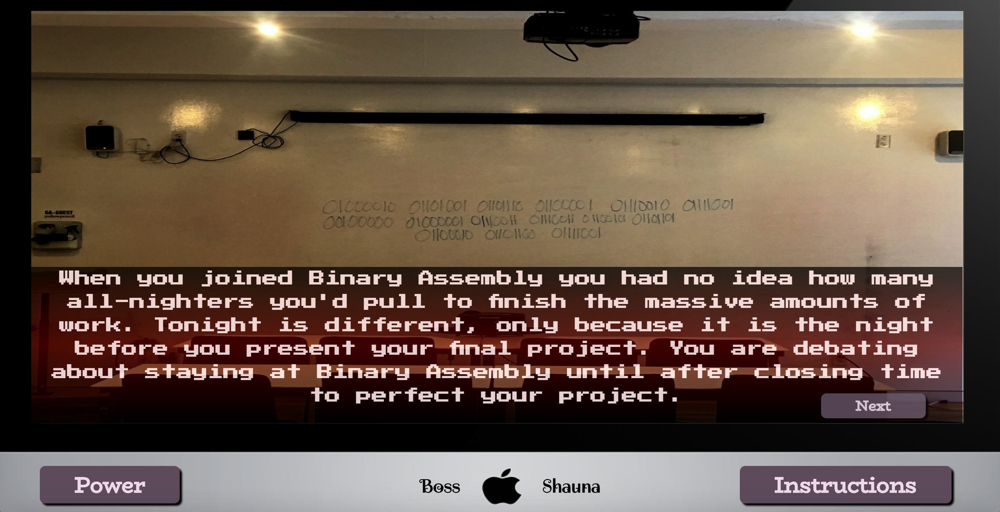

# It Follows
###### A game of choices

### About the Game
This isn’t a game, this is an experience. When the player starts the game it will be black for a second until the page fades in. The start screen will have a computer with a conspicuous power button. When the power button is pressed the computer will turn on and thus the experience begins.

The experience will have ambient sounds that match the choices that the player makes. The choices that are made decides the flow of the game, think classic choose your own adventure game. The experience will have multiple endings, most endings will be bad since I am going for the horror route. To win the player must reach the true ending. 

To restart the game the player will have to click the start over button that appears after a ending has been reached. 

:fire::fire::fire::fire:

### Game Instructions
You dictate the fate of your overnight stay at Binary Assembly. Throughout the game you will be asked to make a choice- think carefully and maybe you'll make it out alive.

### Screenshot of Website


[Link to Website](https://clandestine1.github.io/Visual_Novel/)

[Link to Repository](https://github.com/Clandestine1/Visual_Novel)

### Technologies Used
-jQuery
-HTML
-CSS
-JavaScript

### User Stories
-Be able to use a retry button to restart the game after getting a bad ending
-Have instructions accesible via the game 
-Use ambient music and writing that will set the scary tone of the game

### Unsolved Problems
1.First image doesn't load on github.io
1.I couldn't get all of my page to be responsive

### Approach Taken
Before I even thought about what code I was going to use, I decided to use the agile method to plan my game. First I completed my wireframes which are shown in the next section. After I completed my wireframes I typed psuedo-code, shown below. 

>Power button, screen is black until power button is clicked, onclick event happens that turns on the computer

>Story screen with button that clicks next and moves to either more story or choices

>Choice buttons are event listeners that run a function that proceeds the story according by the choice button

>Set all the text up in HTML. Display all to none in CSS. In JavaScript call the text according to choice event listener using document get element by id. 

>Each choice button is linked to different get element by id function. Display none on every button not needed yet

>Sounds and images that are linked to onclick events

### Project Wireframes


After I completed my psuedo-code I brainstormed all the methods to accomplish my code. The method that I ended up picking was to load all my content in the document then manipulate it in the DOM using jQuery.

###### Example
```$(".next2").click(function(){
 	$(".altText4").show();
 	$(".altText3").hide();
 	});

